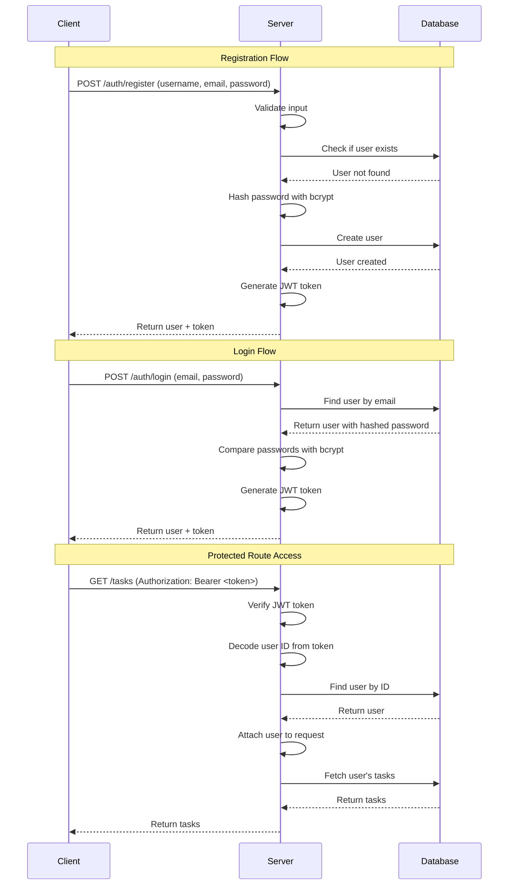

# Smart ToDo API 📝

A production-ready RESTful backend system for task management with **JWT authentication**, built with **clean architecture** principles and industry best practices. This API demonstrates strong fundamentals in security, scalability, and code organization—perfect for technical interviews.

---

## 📋 Table of Contents

- [Overview](#overview)
- [Tech Stack](#tech-stack)
- [Project Structure](#project-structure)
- [Features](#features)
- [Installation](#installation)
- [Environment Variables](#environment-variables)
- [API Endpoints](#api-endpoints)
- [Authentication Flow](#authentication-flow)
- [Authorization Logic](#authorization-logic)
- [Code Quality Highlights](#code-quality-highlights)
- [Assumptions & Design Decisions](#assumptions--design-decisions)
- [Future Improvements](#future-improvements)
- [Troubleshooting](#troubleshooting)

---

## 🎯 Overview

The **Smart ToDo API** is a RESTful backend that allows users to:
- **Register** and **login** securely
- **Create**, **read**, **update**, and **delete** their own tasks
- Manage tasks with **priority** levels and **status** tracking
- Access tasks with **pagination** for scalability

Built from scratch following **interview-ready** standards: modular, well-documented, and easy to explain.

---

## 🛠️ Tech Stack

| Technology | Purpose |
|------------|---------|
| **Node.js** | JavaScript runtime |
| **Express.js** | Web framework for building REST APIs |
| **MongoDB** | NoSQL database for data persistence |
| **Mongoose** | ODM for MongoDB schema modeling |
| **JWT** (jsonwebtoken) | Stateless authentication |
| **bcryptjs** | Password hashing |
| **dotenv** | Environment variable management |
| **express-validator** | Request validation |

---

## 📁 Project Structure

```
ToDo/
├── src/
│   ├── config/              # Configuration files
│   │   ├── db.js           # MongoDB connection
│   │   └── env.js          # Environment variables
│   ├── models/             # Mongoose schemas
│   │   ├── User.js         # User model
│   │   └── Task.js         # Task model
│   ├── controllers/        # Request handlers
│   │   ├── authController.js
│   │   └── taskController.js
│   ├── routes/             # Route definitions
│   │   ├── authRoutes.js
│   │   └── taskRoutes.js
│   ├── middleware/         # Custom middleware
│   │   ├── auth.js         # JWT verification
│   │   ├── taskOwnership.js # Authorization
│   │   └── errorHandler.js  # Centralized error handling
│   ├── utils/              # Utility functions
│   │   ├── generateToken.js
│   │   └── validators.js
│   └── app.js              # Express app entry point
├── .env.example            # Environment template
├── .gitignore
├── package.json
└── README.md
```

### **Why This Structure?**

- **Separation of Concerns**: Each layer has a single responsibility
- **Scalability**: Easy to add new features without touching existing code
- **Testability**: Controllers and middleware can be unit tested independently
- **Readability**: Clear file organization makes code review seamless

---

## ✨ Features

### **Authentication**
- ✅ User registration with unique username/email
- ✅ Secure password hashing with bcrypt (10 rounds)
- ✅ JWT token generation with configurable expiration
- ✅ Protected routes requiring valid authentication

### **Task Management**
- ✅ Create tasks with title, description, status, and priority
- ✅ Get all tasks for the authenticated user (paginated)
- ✅ Update tasks (owner only)
- ✅ Delete tasks (owner only)

### **Security & Authorization**
- ✅ Resource ownership verification
- ✅ No access to other users' tasks
- ✅ Token validation on every protected route

### **Error Handling**
- ✅ Centralized error middleware
- ✅ Consistent JSON error responses
- ✅ Validation errors, duplicate keys, invalid IDs handled gracefully
- ✅ No stack traces exposed in production

### **Pagination**
- ✅ `GET /tasks` supports `?page=1&limit=10`
- ✅ Returns total count and pagination metadata

---

## 🚀 Installation

### **Prerequisites**
- Node.js (v14 or higher)
- MongoDB (local or cloud like MongoDB Atlas)
- Git

### **Steps**

1. **Clone the repository**
   ```bash
   git clone <repository-url>
   cd ToDo
   ```

2. **Install dependencies**
   ```bash
   npm install
   ```

3. **Set up environment variables**
   ```bash
   # Copy the example file
   cp .env.example .env
   
   # Edit .env with your configuration
   # For Windows: copy .env.example .env
   ```

4. **Configure your `.env` file**
   ```env
   PORT=5000
   MONGODB_URI=mongodb://localhost:27017/smart-todo
   JWT_SECRET=your_secure_random_string
   JWT_EXPIRE=24h
   ```

5. **Start the server**
   ```bash
   # Development mode (with auto-restart)
   npm run dev
   
   # Production mode
   npm start
   ```

6. **Verify the server is running**
   ```
   Navigate to: http://localhost:5000
   Expected response:
   {
     "success": true,
     "message": "Smart ToDo API is running",
     "version": "1.0.0"
   }
   ```

---

## 🔐 Environment Variables

Create a `.env` file in the root directory with the following variables:

| Variable | Description | Example |
|----------|-------------|---------|
| `PORT` | Server port number | `5000` |
| `MONGODB_URI` | MongoDB connection string | `mongodb://localhost:27017/smart-todo` |
| `JWT_SECRET` | Secret key for JWT signing | Generate using: `node -e "console.log(require('crypto').randomBytes(64).toString('hex'))"` |
| `JWT_EXPIRE` | JWT token expiration time | `24h`, `7d`, `30m` |

### **MongoDB Setup**

**Option 1: Local MongoDB**
```
MONGODB_URI=mongodb://localhost:27017/smart-todo
```

**Option 2: MongoDB Atlas (Cloud)**
```
MONGODB_URI=mongodb+srv://<username>:<password>@cluster.mongodb.net/smart-todo
```

---

## 📡 API Endpoints

### **Base URL**: `http://localhost:5000`

### **Authentication Endpoints**

#### 1. Register User
```http
POST /auth/register
Content-Type: application/json

{
  "username": "john_doe",
  "email": "john@example.com",
  "password": "password123"
}
```

**Success Response (201)**
```json
{
  "success": true,
  "message": "User registered successfully",
  "data": {
    "user": {
      "id": "6576a1b2c3d4e5f6a7b8c9d0",
      "username": "john_doe",
      "email": "john@example.com",
      "createdAt": "2024-12-24T15:30:00.000Z"
    },
    "token": "eyJhbGciOiJIUzI1NiIsInR5cCI6IkpXVCJ9..."
  }
}
```

#### 2. Login User
```http
POST /auth/login
Content-Type: application/json

{
  "email": "john@example.com",
  "password": "password123"
}
```

**Success Response (200)**
```json
{
  "success": true,
  "message": "Login successful",
  "data": {
    "user": {
      "id": "6576a1b2c3d4e5f6a7b8c9d0",
      "username": "john_doe",
      "email": "john@example.com",
      "createdAt": "2024-12-24T15:30:00.000Z"
    },
    "token": "eyJhbGciOiJIUzI1NiIsInR5cCI6IkpXVCJ9..."
  }
}
```

---

### **Task Endpoints** (All require authentication)

#### 3. Create Task
```http
POST /tasks
Authorization: Bearer <token>
Content-Type: application/json

{
  "title": "Complete project documentation",
  "description": "Write comprehensive README",
  "status": "pending",
  "priority": "high"
}
```

**Success Response (201)**
```json
{
  "success": true,
  "message": "Task created successfully",
  "data": {
    "_id": "6576a2b3c4d5e6f7a8b9c0d1",
    "title": "Complete project documentation",
    "description": "Write comprehensive README",
    "status": "pending",
    "priority": "high",
    "owner": "6576a1b2c3d4e5f6a7b8c9d0",
    "createdAt": "2024-12-24T16:00:00.000Z"
  }
}
```

#### 4. Get All Tasks (Paginated)
```http
GET /tasks?page=1&limit=10
Authorization: Bearer <token>
```

**Success Response (200)**
```json
{
  "success": true,
  "count": 10,
  "pagination": {
    "currentPage": 1,
    "totalPages": 3,
    "totalTasks": 25,
    "limit": 10
  },
  "data": [
    {
      "_id": "6576a2b3c4d5e6f7a8b9c0d1",
      "title": "Complete project documentation",
      "description": "Write comprehensive README",
      "status": "pending",
      "priority": "high",
      "owner": "6576a1b2c3d4e5f6a7b8c9d0",
      "createdAt": "2024-12-24T16:00:00.000Z"
    }
  ]
}
```

#### 5. Update Task
```http
PUT /tasks/:id
Authorization: Bearer <token>
Content-Type: application/json

{
  "status": "completed"
}
```

**Success Response (200)**
```json
{
  "success": true,
  "message": "Task updated successfully",
  "data": {
    "_id": "6576a2b3c4d5e6f7a8b9c0d1",
    "title": "Complete project documentation",
    "status": "completed",
    "priority": "high",
    "owner": "6576a1b2c3d4e5f6a7b8c9d0"
  }
}
```

#### 6. Delete Task
```http
DELETE /tasks/:id
Authorization: Bearer <token>
```

**Success Response (200)**
```json
{
  "success": true,
  "message": "Task deleted successfully",
  "data": {}
}
```

---

### **Error Responses**

#### Validation Error (400)
```json
{
  "success": false,
  "message": "Please provide a task title"
}
```

#### Unauthorized (401)
```json
{
  "success": false,
  "message": "Not authorized to access this route. Please provide a valid token."
}
```

#### Forbidden (403)
```json
{
  "success": false,
  "message": "Not authorized to access this task"
}
```

#### Not Found (404)
```json
{
  "success": false,
  "message": "Task not found"
}
```
---
### Postman Collection URL

- For testing these APIs, you can use the Postman collection available at: [SmartToDo.postman_collection.json](SmartToDo.postman_collection.json)

---

---

## 🔒 Authentication Flow


---

## 🛡️ Authorization Logic

### **How Task Ownership Works**

1. **User creates a task**: The `owner` field is automatically set to the authenticated user's ID
2. **User tries to update/delete a task**:
   - `auth` middleware verifies the JWT token
   - `verifyTaskOwnership` middleware checks if the task exists
   - It compares `task.owner` with `req.user._id`
   - If they don't match → **403 Forbidden**
   - If they match → request proceeds to controller

### **Middleware Chain**
```javascript
router.put('/:id', 
  protect,                  // Step 1: Verify JWT
  verifyTaskOwnership,      // Step 2: Check ownership
  updateTaskValidation,     // Step 3: Validate input
  updateTask                // Step 4: Update task
);
```

---

## 💎 Code Quality Highlights

### **1. Modular Architecture**
- **Separation of concerns**: Routes → Controllers → Models
- **Reusable middleware**: Auth and ownership checks are DRY
- **Centralized configuration**: All env variables in one place

### **2. Security Best Practices**
- Passwords hashed with bcrypt (10 salt rounds)
- JWTs expire after configurable time
- Password field excluded from queries by default (`select: false`)
- No sensitive data in error messages

### **3. Error Handling**
- Single error handler for the entire app
- Mongoose errors (CastError, ValidationError, Duplicate Key) handled gracefully
- Consistent error response format

### **4. Input Validation**
- All endpoints validated using `express-validator`
- Custom error messages for better UX
- Email format, password strength, field lengths enforced

### **5. Database Optimization**
- Index on `Task.owner` for faster queries
- Pagination to prevent fetching too much data

### **6. Code Readability**
- Descriptive variable and function names
- JSDoc comments on all functions
- Inline comments where logic isn't obvious

---

## 🤔 Assumptions & Design Decisions

### **Assumptions**
1. Users have access to MongoDB (local or cloud)
2. Testing will be done via Postman/Insomnia/curl
3. No frontend is required
4. Email verification is out of scope

### **Design Decisions**

| Decision | Rationale |
|----------|-----------|
| **bcryptjs over bcrypt** | Better cross-platform compatibility (no native dependencies) |
| **Pagination only** | Keeping enhancement simple; sorting/filtering can be added later |
| **24h JWT expiration** | Balance between security and UX; adjustable via env var |
| **No refresh tokens** | Simplifies implementation for interview purposes |
| **Mongoose over native driver** | Schema validation, cleaner syntax, middleware support |
| **Express-validator** | Industry standard, flexible, great error messages |

### **Trade-offs**
- **No unit tests**: Out of scope, but structure supports easy testing
- **Simple CORS**: Production apps should use `cors` package with whitelisting
- **No rate limiting**: Would prevent brute-force attacks in production
- **No logging**: Production apps should use Winston or Morgan

---

## 🚀 Future Improvements

If this were a production application, I would add:

1. **Refresh Tokens**: Improve security with short-lived access tokens
2. **Email Verification**: Send verification email on registration
3. **Password Reset**: Forgot password flow with email tokens
4. **Rate Limiting**: Prevent abuse with `express-rate-limit`
5. **Logging**: Request/error logging with Winston
6. **API Documentation**: Auto-generated docs with Swagger/OpenAPI
7. **Unit & Integration Tests**: Jest/Mocha with Supertest
8. **Task Filtering & Sorting**: Filter by status/priority, sort by date
9. **Task Due Dates**: Add deadline tracking
10. **User Profiles**: Add avatar, bio, preferences

---

## 🔧 Troubleshooting

### **Issue: "Cannot connect to MongoDB"**
**Solution**: 
- Ensure MongoDB is running: `mongod` (local) or check Atlas connection string
- Verify `MONGODB_URI` in `.env` is correct

### **Issue: "npm install fails"**
**Solution**:
- Clear npm cache: `npm cache clean --force`
- Delete `node_modules` and `package-lock.json`, then run `npm install` again

### **Issue: "Token expired" errors**
**Solution**:
- Login again to get a new token
- Adjust `JWT_EXPIRE` in `.env` for longer-lived tokens

### **Issue: "Duplicate key error"**
**Solution**:
- Username or email already exists
- Use a different username/email or login with existing credentials

### **Issue: Port 5000 already in use**
**Solution**:
- Change `PORT` in `.env` to another port (e.g., 3000, 8000)

---

## 📝 License

This project is open source and available under the [ISC License](https://opensource.org/licenses/ISC).

---

## 👨‍💻 Author

Built with ❤️ as a demonstration of clean architecture and RESTful API best practices.

**Ready for technical interviews and code reviews!**

---

## 🙏 Acknowledgments

- Express.js community for excellent documentation
- MongoDB team for Mongoose ODM
- All open-source contributors

---

**Happy Coding! 🚀**
